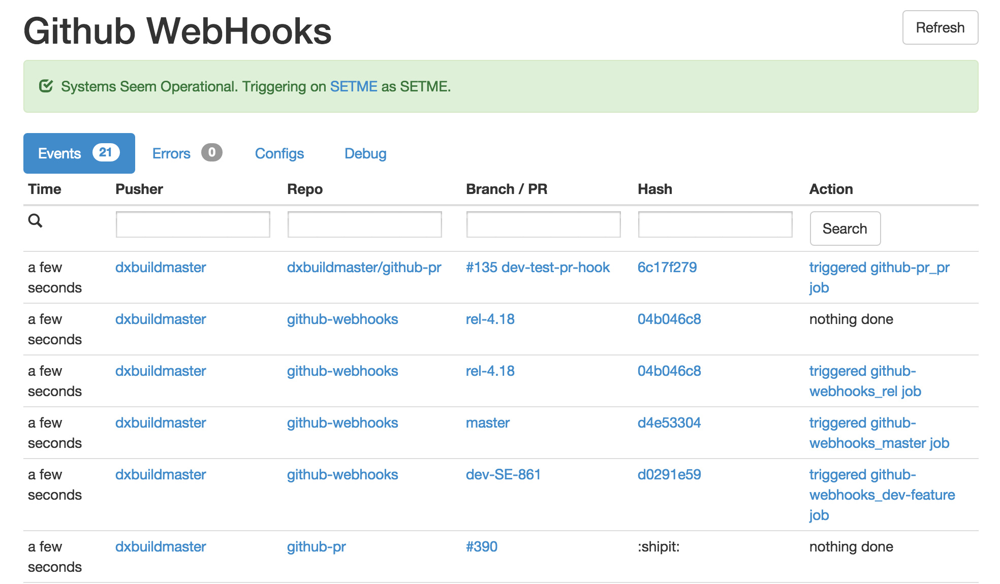

# Github Webhooks
Server that handles webhook requests from GitHub and triggers jobs on Jenkins. Requires a running instance of [MongoDB](https://github.com/mongodb/mongo). The interface shows recent events and provides search functionality.



## Running

In a separate shell startup your mongo database:

    mongodb --dbpath /tmp

Install dependencies

    virtualenv webhooks_env
    . ./webhooks_env/bin/activate
    pip install -r requirements.txt

Set any environment variables

    export JENKINS_USER=buildmaster

Run Webhooks

    python main.py

You should see the following output and be able to visit the webpage at http://localhost:5001

    $ python main.py
    {'MONGO_DB_NAME': 'dxmanager', 'JENKINS_USER': 'SETME', 'JENKINS_JOB_TOKEN': 'SETME', 'MONGO_DB_PORT': 27017, 'JENKINS_USER_TOKEN': 'SETME', 'JENKINS_URL': 'SETME', 'MONGO_DB_HOST': 'localhost', 'TEST': False, 'DEBUG': True, 'PORT': 5001}
    Loading MONGO_DB_NAME as dxmanager
    Loading JENKINS_USER as SETME
    Loading JENKINS_JOB_TOKEN as SETME
    Loading MONGO_DB_PORT as 27017
    Loading JENKINS_USER_TOKEN as SETME
    Loading JENKINS_URL as SETME
    Loading MONGO_DB_HOST as localhost
    Loading TEST as False
    Loading MAP_CONFIG as map_configs/dx_map_config.yml
    Loading DEBUG as True
    Loading PORT as 5001
     * Running on http://0.0.0.0:5001/

### Running in Docker

Run a mongodb container and then github-webhooks with the correct parameters passed in.

```
docker run -d --name mongodb -p 27017:27017 dockerfile/mongodb mongod --smallfiles
docker run -d --name github-webhooks -p 80:8080 --link mongodb:mongodb -e MONGO_DB_HOST=mongodb -e JENKINS_URL={{ JENKINS_URL }} -e JENKINS_USER={{ JENKINS_USER }} -e JENKINS_USER_TOKEN={{ JENKINS_USER_TOKEN }} -e JENKINS_JOB_TOKEN={{ JENKINS_JOB_TOKEN }} dataxu/github-webhooks
```

## Mapping Configurations

Look in [map_configs](/map_configs/) to see examples of configurations that map commit information to which jobs to trigger. This file must be of [YAML Syntax](http://yaml.org/) and can be overwritten with the `MAP_CONFIG` environment variable. There is a `match` that specifies what the hook will match on and a `trigger` that specifies how a job can be triggered.

All commits of the dataxu/github-webhooks master branch trigger the github-webhooks_master job.

```
push:
    - match:
        repo: "github-webhooks"
        owner: "dataxu"
        branch: "master"
      trigger:
        job: "github-webhooks_master"
```

Macros are also supported, in curly braces, to allow similar behavior for multiple repos.

```
push:
    - match:
        owner: "dataxu"
        branch: "master"
      trigger:
        job: "{repo}_master"
```

Match parameters are treated as regular expressions. Match parameters not set are not used during matching. For example, if `branch` is not set, it will match on all branches.

```
push:
    - match:
        repo: "github-.*"
        owner: "dataxu"
        branch: "master"
      trigger:
        job: "{repo}_master"
```

Triggers can take job parameters. Current trigger macros are: `branch`, `repo`, `owner`, `pr_number`, `comment`, `issue_number`.

```
push:
    - match:
        owner: "dataxu"
        branch: "dev-.*"
      trigger:
        job: "{repo}_dev"
        params:
            branch: "{branch}"
```

We can match on pull requests and issue comments as well.

```
pr:
    - match:
        actions:
          - opened
          - synchronize
      trigger:
        job: "{repo}_pr"
        params:
            fork: "{owner}"
            branch: "{branch}"
            pr_number: "{pr_number}"

issue:
    - match:
        owner: "dataxu"
        message: ".*:shipit:.*"
        actions:
          - created
      trigger:
        job: "tools_handle-comment"
        params:
            repo: "{repo}"
            comment: "{comment}"
            issue_number: "{issue_number}"
```

See the [DataXu Configuration](/map_configs/dx_map_config.yml) for a comprehensive example.

## Tests

In a separate shell startup your mongo database (assumes you have mongo
installed already):

    mongodb --dbpath /tmp

Then run the tests:

    python ./webhooks_test.py

Contributing
------------

See [docs/contributing.md](/docs/contributing.md)


This code was originally developed at [DataXu](https://www.dataxu.com/) and released as open source under the New BSD License.
